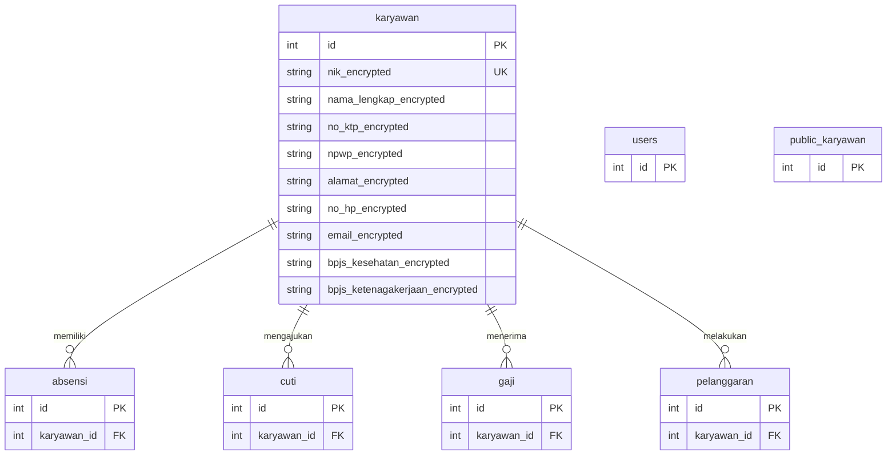

# Analisis Backup Database HRD Pabrik

## 📋 Informasi Umum Backup

- **Nama Database**: `hrd_pabrik_db`
- **Tanggal Backup**: 19 September 2025, 08:22:12
- **Format**: PostgreSQL Custom Format (compressed with gzip)
- **Versi PostgreSQL**: 12.22 (Ubuntu 12.22-0ubuntu0.20.04.4)
- **Total TOC Entries**: 57 items
- **Owner**: `hrd_user`

---

## 🗂️ Struktur Database

Database ini berisi **7 tabel utama** untuk sistem HRD pabrik:

### 1. **Tabel `karyawan`** (Data Karyawan)
Tabel utama yang menyimpan informasi karyawan dengan **enkripsi data sensitif**.

**Kolom-kolom yang dienkripsi**:
- `nama_lengkap_encrypted` - Nama lengkap karyawan
- `nik_encrypted` - Nomor Induk Karyawan
- `no_ktp_encrypted` - Nomor KTP
- `npwp_encrypted` - Nomor NPWP
- `tempat_lahir_encrypted` - Tempat lahir
- `alamat_encrypted` - Alamat
- `no_hp_encrypted` - Nomor HP
- `email_encrypted` - Email
- `bpjs_kesehatan_encrypted` - Nomor BPJS Kesehatan
- `bpjs_ketenagakerjaan_encrypted` - Nomor BPJS Ketenagakerjaan
- `nama_kontak_darurat_encrypted` - Nama kontak darurat
- `no_telepon_kontak_darurat_encrypted` - No. telepon kontak darurat
- `hubungan_kontak_darurat_encrypted` - Hubungan dengan kontak darurat

> [!IMPORTANT]
> Tabel karyawan menggunakan **enkripsi tingkat kolom** untuk melindungi data pribadi karyawan. Ini menunjukkan implementasi keamanan yang baik sesuai dengan regulasi perlindungan data.

**Constraint**:
- Primary Key: `karyawan_pkey`
- Unique Constraint: `uk_nik_encrypted` (memastikan NIK unik)

---

### 2. **Tabel `absensi`** (Data Kehadiran)
Menyimpan catatan kehadiran karyawan.

**Relasi**:
- Foreign Key ke tabel `karyawan` (`fkq3hqgb6786q2yl218i9vg88qj`)

**Sequence**: `absensi_id_seq` (auto-increment ID)

---

### 3. **Tabel `cuti`** (Data Cuti)
Menyimpan informasi pengajuan dan persetujuan cuti karyawan.

**Relasi**:
- Foreign Key ke tabel `karyawan` (`fkkp42ctw2oli9toj0fq2pjifyf`)

**Sequence**: `cuti_id_seq`

---

### 4. **Tabel `gaji`** (Data Gaji)
Menyimpan informasi penggajian karyawan.

**Relasi**:
- Foreign Key ke tabel `karyawan` (`fkp3ec7svhmvo3s9ne1nuk7ep7b`)

**Sequence**: `gaji_id_seq`

---

### 5. **Tabel `pelanggaran`** (Data Pelanggaran)
Menyimpan catatan pelanggaran yang dilakukan karyawan.

**Relasi**:
- Foreign Key ke tabel `karyawan` (`fkhq3lbq7mpxhkv6l15ligwwano`)

**Sequence**: `pelanggaran_id_seq`

---

### 6. **Tabel `public_karyawan`** (Data Publik Karyawan)
Kemungkinan berisi informasi karyawan yang tidak sensitif atau untuk keperluan publik internal.

**Constraint**:
- Primary Key: `public_karyawan_pkey`

---

### 7. **Tabel `users`** (Data Pengguna Sistem)
Menyimpan informasi pengguna yang dapat mengakses sistem HRD.

**Constraint**:
- Primary Key: `users_pkey`
- Unique Constraint: `ukr43af9ap4edm43mmtq01oddj6`

**Sequence**: `users_id_seq`

---

## 🔗 Diagram Relasi



---

## 🔐 Fitur Keamanan

1. **Enkripsi Data Sensitif**: 13 kolom pada tabel `karyawan` menggunakan enkripsi
2. **Unique Constraint pada NIK**: Mencegah duplikasi data karyawan
3. **Foreign Key Constraints**: Menjaga integritas referensial data
4. **Compressed Backup**: Backup menggunakan gzip compression untuk efisiensi penyimpanan

---

## 📊 Isi Data Backup

Backup ini mencakup:
- ✅ **Struktur tabel** (CREATE TABLE statements)
- ✅ **Data tabel** (TABLE DATA untuk semua 7 tabel)
- ✅ **Sequences** (nilai auto-increment untuk 6 sequences)
- ✅ **Constraints** (Primary Keys, Foreign Keys, Unique Constraints)
- ✅ **Comments** (dokumentasi kolom-kolom terenkripsi)

---

## 🛠️ Cara Restore Backup

### Restore ke database baru:
```bash
createdb hrd_pabrik_db_restored
pg_restore -d hrd_pabrik_db_restored "E:\code\kerjaan\PT Padud Jaya Putera\backup database\2025-09\hrd_pabrik_db_20250919_082212.backup"
```

### Restore ke database yang sudah ada (dengan clean):
```bash
pg_restore -d hrd_pabrik_db --clean "E:\code\kerjaan\PT Padud Jaya Putera\backup database\2025-09\hrd_pabrik_db_20250919_082212.backup"
```

### Restore hanya struktur (tanpa data):
```bash
pg_restore -d hrd_pabrik_db --schema-only "E:\code\kerjaan\PT Padud Jaya Putera\backup database\2025-09\hrd_pabrik_db_20250919_082212.backup"
```

### Restore hanya data (tanpa struktur):
```bash
pg_restore -d hrd_pabrik_db --data-only "E:\code\kerjaan\PT Padud Jaya Putera\backup database\2025-09\hrd_pabrik_db_20250919_082212.backup"
```

### Restore tabel tertentu saja:
```bash
# Contoh: hanya restore tabel karyawan
pg_restore -d hrd_pabrik_db -t karyawan "E:\code\kerjaan\PT Padud Jaya Putera\backup database\2025-09\hrd_pabrik_db_20250919_082212.backup"
```

---

## ⚠️ Catatan Penting

> [!WARNING]
> Backup ini berisi **data pribadi karyawan yang terenkripsi**. Pastikan:
> - Backup disimpan di lokasi yang aman
> - Akses dibatasi hanya untuk personel yang berwenang
> - Kunci enkripsi disimpan terpisah dari backup
> - Backup tidak dibagikan melalui channel yang tidak aman

> [!CAUTION]
> Sebelum melakukan restore ke production database:
> - Buat backup database yang ada saat ini
> - Test restore di environment development terlebih dahulu
> - Pastikan aplikasi tidak sedang digunakan (maintenance mode)
> - Verifikasi kompatibilitas versi PostgreSQL

---

## 📝 Kesimpulan

Backup ini adalah **backup lengkap** dari sistem HRD pabrik yang mencakup:
- Data karyawan dengan enkripsi
- Catatan absensi
- Data cuti
- Informasi penggajian
- Catatan pelanggaran
- Data pengguna sistem

Backup dibuat pada **19 September 2025** dan dapat digunakan untuk:
- Disaster recovery
- Migrasi database
- Testing dan development
- Audit data historis
